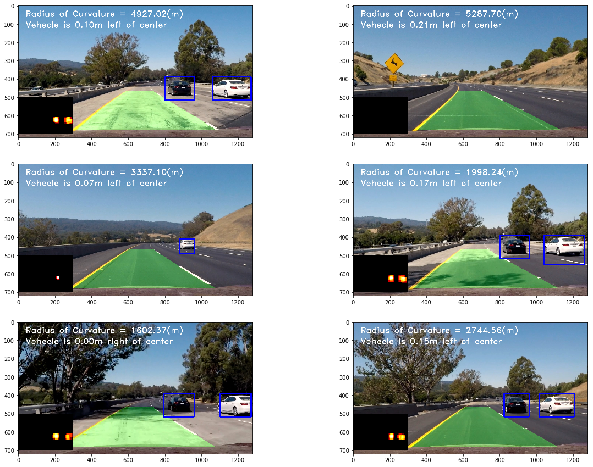

**Vehicle Detection Project**

---

The goals / steps of this project are the following:

* Perform a Histogram of Oriented Gradients (HOG) feature extraction on a labeled training set of images and train a classifier Linear SVM classifier
* Apply a color transform and append binned color features, as well as histograms of color, to your HOG feature vector. 
* Implement a sliding-window technique and use your trained classifier to search for vehicles in images.
* Run pipeline on a video stream (start with the test_video.mp4 and later implement on full project_video.mp4) and create a heat map of recurring detections frame by frame to reject outliers and follow detected vehicles.
* Estimate a bounding box for vehicles detected.

---
### Writeup / README

#### 1. Provide a Writeup / README that includes all the rubric points and how you addressed each one. 

You're reading it!

### Reviewing the impo

For training the classification between veheicles and non-vehecles, I used the Udacity's labeled datasets available [here](https://github.com/udacity/self-driving-car/tree/master/annotations). Here are the examples of the images available in the data set.

### Histogram of Oriented Gradients (HOG)

#### 1. Explain how (and identify where in your code) you extracted HOG features from the training images.

The code for this step is contained in the cells 4,5 of the IPython notebook file [here](https://github.com/ahmadesh/CarND-Vehicle-Detection/blob/master/Project.ipynb). I created a function for getting the images and output the HOG feature image. I explored different different `skimage.hog()` parameters and I ended up by using (`orientations`, `pixels_per_cell`, and `cells_per_block`).  I grabbed random images from each of the two classes and displayed them to get a feel for what the `skimage.hog()` output looks like. Here is an example using the gray color space input and HOG parameters of `orientations=11`, `pixels_per_cell=(8, 8)` and `cells_per_block=(2, 2)`:

####2. Explain how you settled on your final choice of HOG parameters.

I tried various combinations of parameters and chose the HOG parameters that provided the maximum prediction accuracy on the test-set after training.

####3. Describe how (and identify where in your code) you trained a classifier using your selected HOG features (and color features if you used them).

I trained a linear SVM, in cell 8, using the features from the `extract_features()` function in cell 7 that stacks the HOG, Spatial binning and color histogram features. These features are then scaled using `StandardScaler()` in sklearn library for training. The final parametrs that I used for extracting the features are:
`
HOG orientations = 11
pix_per_cell = (8,8)
cell_per_block = (2,2)
hog_channel = 'ALL'
spatial binning size = (16, 16) 
histogram bins = 32
`
The data are then split into training and test sets with 80% to 20% ratio. For tuning the colorspace and the `C` parameter used in the SVM classifier I used `GridSearchCV` function to search for the best combination. Between the cases I searched, the best comibnation was achieved by `YUV` colorspace and `C=0.1`. 

###Sliding Window Search

####1. Describe how (and identify where in your code) you implemented a sliding window search.  How did you decide what scales to search and how much to overlap windows?

I used a slidng window function in cell 9 of the code that takes the image along with `ystart, ystop, xstart, xstop, scale, cells_per_step` parameters to search for the car in that subimage using the SVM calssifier. I experimented with the sliding window on the image at different scales and locations on a sample image. The final windows that I setteled down are shown in the following:

I only search for vehecles in the lower section of the image. The search boxes are composed of 3 scales of `1.25, 2, 3`. The biger booxes with `2,3` scales are distributed on the two sides of the image as the large scale cars can only be found at these locations. The smaller scale `1.25` boxes are distribute over the width of the image. 

####2. Show some examples of test images to demonstrate how your pipeline is working.  What did you do to optimize the performance of your classifier?

Ultimately I searched on 3 scales using YUV 3-channel HOG features plus spatially binned color and histograms of color in the feature vector, which provided a nice result.  Here are some example images:

---

### Video Implementation

####1. Provide a link to your final video output.  Your pipeline should perform reasonably well on the entire project video (somewhat wobbly or unstable bounding boxes are ok as long as you are identifying the vehicles most of the time with minimal false positives.)
Here's a [link to my video result](https://github.com/ahmadesh/CarND-Vehicle-Detection/blob/master/project_video_out.mp4).

####2. Describe how (and identify where in your code) you implemented some kind of filter for false positives and some method for combining overlapping bounding boxes.

I recorded the positions of positive detections in each frame of the video. From the positive detections I created a heatmap and then thresholded that map to identify vehicle positions.  I then used `scipy.ndimage.measurements.label()` to identify individual blobs in the heatmap.  I then assumed each blob corresponded to a vehicle.  I constructed bounding boxes to cover the area of each blob detected. The codes of this part are available at cells 18-25. 

Here are six frames and their corresponding heatmaps, output of `scipy.ndimage.measurements.label()` on the integrated heatmap from all six frames and the resulting bounding boxes on the original frame.

Finally in the cell 26, I implemented the pipeline for processing the video frames using the described steps. I also added a list variable that keeps the found veheicle boxes in the `n=30`previous frames and adds the boxes in the current frame to it. The final heatmap of the frame is calculated as the summation over last `30` heatmaps. The thresholde for filtering this heatmap is considered proportional with the number of frames. Also, I created a LaneFinder class from the previous project that finds and draws the area between the lanes on the image. I used this class to fill the area between the two lanes. Here is the final image output for the video images:

---

###Discussion

####1. Briefly discuss any problems / issues you faced in your implementation of this project.  Where will your pipeline likely fail?  What could you do to make it more robust?

In this project I used SVM classifier and HOG, Spatial binning and color histogram features of an image to determine the position of veheicles (if any) in the image of a video. The output videos puts boxes around the detected veheicles.

The first challange for this project was to choose the best comination of features and the specific parameters used (such as color space, HOG parameters, SVM C parameter and etc.). I spend lots of time choosing the best comibnation. Automizing the decision (gridsearch) between all parameters could be very computationaly expensive, so I chose a few parameters to do the grid search. This could be extended to other parametrs as well for the best classiifcation results. 

The second challange was the sliding window search and threshholding as it is fundamentally affecting the results. Using large windows could not localize the smaller veheicles and using smalle windows could be computationally expencive and may not classify the larger vehecles. So, there should be a balance and correct locations for these windows for the best results with minimum computation. Also thresholding the number of hot pixels could afect the results directly. The decision in this section for 'good'/'bad' classifcation and localization of veheicles was visually and by looking at the output video. To optimize the hyper parameters (sliding boxes locations and scales, theresholds) in this section it would be nice to use some training videos with known veheicle boxes in each frame. Then by defining an error function we can find the comibation of hyper parametrs that minmize the error function. 

Finally, to continue this project, instead of SVM classifer I would use Convolutional Neural Netwoek as was explained in this projet [here](https://github.com/antevis/CarND-Project5-Vehicle_Detection_and_Tracking). CNNs could not only classify the veheicles in an image but also, localize the hot pixels related to the veheicls with better accuracy compared to SVM. This could greatly increase the performance of the algorithm.
